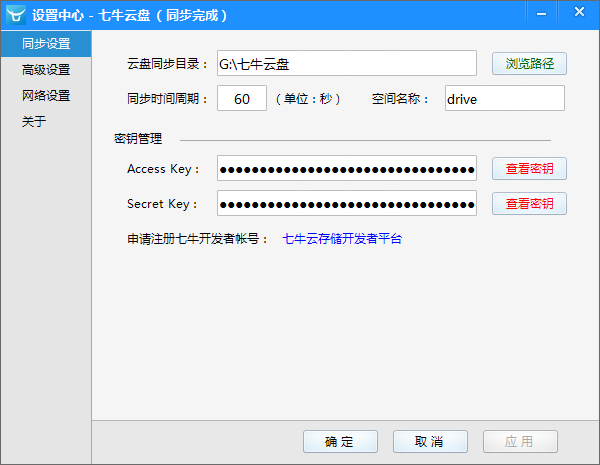

七牛云盘
==========

七牛云盘是基于七牛开放 API 构建的第三方同步程序。

下载地址：[七牛云存储](http://drive.u.qiniudn.com/%E4%B8%83%E7%89%9B%E4%BA%91%E7%9B%98/%E4%B8%83%E7%89%9B%E4%BA%91%E7%9B%98.rar?download)

**特别注意** 当前版本未经过长时间连续运行测试，目前尚属 Beta 状态，请不要将重要数据在未任何其它备份的情况下依赖本软件。

## 开发初衷

我是一个强迫症非常严重的人，自从用了 GitHub 后病情更甚：我患上了可怕的 commit 强迫症。由于随时都可能切换工作电脑，因此我希望可以保证我的代码是同步的。而 commit 非常多了之后，.git 历史文件会变得巨大无比，超出源代码体积百倍之余。故，我开发了这简易的多设备同步客户端。

为什么不用网盘呢？是啊，我有几十 T 一辈子不存 A 片都用不完的体积，为啥不用呢？不能按自己需求改。

只支持 Windows，能干蛋啊？当什么都干不了的时候，干蛋也是一种不错的选择。由于自身需要，未来会使用 Go 开发可运行在其余平台上的客户端。

## 软件功能（v0.1）

- 自动对指定目录与七牛云存储空间的文件进行 **双向** 同步。
- 支持设置 `Config/ignore.txt` 进行文件过滤。
	- `*.txt` 表示后缀过滤。
	- `look*` 表示前缀过滤。
	- `ok/fine.txt` 表示相对于同步目录的相对路径过滤。

## 注意事项

- 当前版本仅支持操作 **公开** 空间。
- 由于本软件与七牛云存储非 C/S 架构，**不可用** 于实时性要求高的任务。
- 由于七牛云存储的未知原因，删除操作可能存在 1 秒左右的缓存，因此 **删除操作被迫暂停 1 秒** 后继续执行拉取文件列表，否则会删除失败。
- 书写文件过滤规则时，目录分割符均为 `/`。

## 主要原理

- 同步周期：为节省 API 调用次数，软件根据用户指定周期（默认为 60 秒）进行文件差异判断，因此如果您在不同设备间进行同步，务必人为确保完成同步后，再修改其它设备上的文件。
- 差异判断：通过文件最后修改时间完成差异判断，因此如果您通过其它手段非正常修改文件时间后可能会导致同步结果无法预料。
- 文件删除：每次同步完成后会将本地文件建立缓存列表并保存至 `Data/file_cache_list`，在下次同步开始前，将缓存列表与新的本次文件列表进行对比，从而找出被删除项。因此，您对该文件的任何非法改动都可能将导致您的数据意外丢失！

## 界面预览

